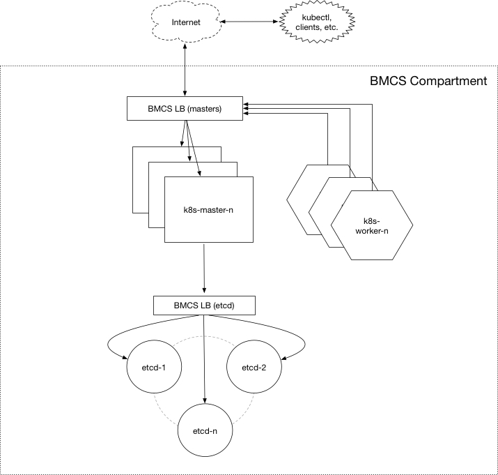

[terraform]: https://terraform.io
[oci]: https://cloud.oracle.com/cloud-infrastructure
[oci provider]: https://github.com/oracle/terraform-provider-oci/releases
[API signing]: https://docs.us-phoenix-1.oraclecloud.com/Content/API/Concepts/apisigningkey.htm
[Kubectl]: https://kubernetes.io/docs/tasks/tools/install-kubectl/

# Terraform Kubernetes Installer for Oracle Cloud Infrastructure

[](https://app.wercker.com/project/byKey/7dd9fa20b980673dc0e252961950f590)

## About

The Kubernetes Installer for Oracle Cloud Infrastructure provides a Terraform-based Kubernetes installation for Oracle 
Cloud Infrastructure. It consists of a set of [Terraform][terraform] modules and an example base configuration that is 
used to provision and configure the resources needed to run a highly available and configurable Kubernetes cluster on [Oracle Cloud Infrastructure][oci] (OCI).


## Cluster Overview

Terraform is used to _provision_ the cloud infrastructure and any required local resources for the Kubernetes cluster including:

#### OCI Infrastructure

- Virtual Cloud Network (VCN) with dedicated subnets for etcd, masters, and workers in each availability domain
- Dedicated compute instances for etcd, Kubernetes master and worker nodes in each availability domain
- [Public or Private](./docs/input-variables.md#network-access-configuration) TCP/SSL OCI Load Balancer to distribute traffic to the Kubernetes Master(s)
- [Public or Private](./docs/input-variables.md#network-access-configuration) TCP/SSL OCI Load Balancer to distribute traffic to the node(s) in the etcd cluster
- [Optional](./docs/input-variables.md#private-network-access) NAT instance for Internet-bound traffic on any private subnets
- 2048-bit SSH RSA Key-Pair for compute instances when not overridden by `ssh_private_key` and `ssh_public_key_openssh` [input variables](./docs/input-variables.md#tls-certificates--ssh-key-pair)
- Self-signed CA and TLS cluster certificates when not overridden by the [input variables](./docs/input-variables.md#tls-certificates--ssh-key-pair) `ca_cert`, `ca_key`, etc.

#### Cluster Configuration

Terraform uses cloud-init scripts to handle the instance-level _configuration_ for instances in the Control Plane to 
configure:

- Highly Available (HA) Kubernetes master configuration
- Highly Available (HA) etcd cluster configuration
- Optional [GPU support](./docs/gpu-workers.md) for worker nodes that need to run specific workloads
- Kubernetes Dashboard and kube-DNS cluster add-ons
- Kubernetes RBAC (role-based authorization control)
- Integration with OCI [Cloud Controller Manager](https://github.com/oracle/oci-cloud-controller-manager) (CCM)
- Integration with OCI [Flexvolume Driver](https://github.com/oracle/oci-flexvolume-driver)

The Terraform scripts also accept a number of other [input variables](./docs/input-variables.md) to choose instance shapes (including GPU) and how they are placed across the availability domain (ADs), etc. If your requirements extend beyond the base configuration, the modules can be used to form your own customized configuration.



## Prerequisites

1. Download and install [Terraform][terraform] (v0.10.3 or later)
2. Download and install the [OCI Terraform Provider][oci provider] (v2.0.0 or later)
3. Create an Terraform configuration file at  `~/.terraformrc` that specifies the path to the OCI provider:
```
providers {
  oci = "<path_to_provider_binary>/terraform-provider-oci"
}
```
4.  Ensure you have [Kubectl][Kubectl] installed if you plan to interact with the cluster locally

###### Optionally create separate IAM resources for OCI plugins

The OCI [Cloud Controller Manager (CCM)](https://github.com/oracle/oci-cloud-controller-manager) and [Volume Provisioner (VP)](https://github.com/oracle/oci-volume-provisioner) enables Kubernetes to dynamically provision OCI resources such as Load Balancers and Block Volumes as a part of pod and service creation. In order to facilitate this, OCI credentials and OCID information are automatically stored in the cluster as a Kubernetes Secret.

By default, the credentials of the user creating the cluster is used. However, in some cases, it makes sense to use a more restricted set of credentials whose policies are limited to a particular set of resources within the compartment.

To Terraform separate IAM users, groups, and policy resources, run the `terraform plan` and `terraform apply` commands from the `identity` directory and set the appropriate [input variables](./docs/input-variables.md#mandatory-input-variables) relating to your custom users, fingerprints, and key paths.

## Quick start

### Customize the configuration

Create a _terraform.tfvars_ file in the project root that specifies your configuration.

```bash
# start from the included example
$ cp terraform.example.tfvars terraform.tfvars
```

* Set [mandatory](./docs/input-variables.md#mandatory-input-variables) OCI input variables relating to your tenancy, user, and compartment.
* Override [optional](./docs/input-variables.md#optional-input-variables) input variables to customize the default configuration.

### Deploy the cluster

Initialize Terraform:

```
$ terraform init
``` 

View what Terraform plans do before actually doing it:

```
$ terraform plan
```

Use Terraform to Provision resources and stand-up k8s cluster on OCI:

```
$ terraform apply
```

### Access the cluster

The Kubernetes cluster will be running after the configuration is applied successfully and the cloud-init scripts have been given time to finish asynchronously. Typically, this takes around 5 minutes after `terraform apply` and will vary depending on the overall configuration, instance counts, and shapes.

A working kubeconfig can be found in the `./generated` folder or generated on the fly using the `kubeconfig` Terraform output variable.

Your network access settings determine whether your cluster is accessible from the outside. See [Accessing the Cluster](./docs/cluster-access.md) for more details.

#### Verify the cluster:

If you've chosen to configure a public cluster, you can do a quick and automated verification of your cluster from 
your local machine by running the `cluster-check.sh` located in the `scripts` directory.  Note that this script requires your KUBECONFIG environment variable to be set (above), and SSH and HTTPs access to be open to etcd and worker nodes.

To temporarily open access SSH and HTTPs access for `cluster-check.sh`, add the following to your `terraform.tfvars` file:

```bash
# warning: 0.0.0.0/0 is wide open. remember to undo this.
etcd_ssh_ingress = "0.0.0.0/0"
master_ssh_ingress = "0.0.0.0/0"
worker_ssh_ingress = "0.0.0.0/0"
master_https_ingress = "0.0.0.0/0"
worker_nodeport_ingress = "0.0.0.0/0"
```

```bash
$ scripts/cluster-check.sh
```
```
[cluster-check.sh] Running some basic checks on Kubernetes cluster....
[cluster-check.sh]   Checking ssh connectivity to each node...
[cluster-check.sh]   Checking whether instance bootstrap has completed on each node...
[cluster-check.sh]   Checking Flannel's etcd key from each node...
[cluster-check.sh]   Checking whether expected system services are running on each node...
[cluster-check.sh]   Checking status of /healthz endpoint at each k8s master node...
[cluster-check.sh]   Checking status of /healthz endpoint at the LB...
[cluster-check.sh]   Running 'kubectl get nodes' a number of times through the master LB...

The Kubernetes cluster is up and appears to be healthy.
Kubernetes master is running at https://129.146.22.175:443
KubeDNS is running at https://129.146.22.175:443/api/v1/proxy/namespaces/kube-system/services/kube-dns
kubernetes-dashboard is running at https://129.146.22.175:443/ui
```

### Deploy a simple load-balanced application with shared volumes

Check out the [example application deployment](./docs/example-deployments.md) for a walk through of deploying a simple application that leverages both the Cloud Controller Manager and Flexvolume Driver plugins.

### Scale, upgrade, or delete the cluster

Check out the [example cluster operations](./docs/examples.md) for details on how to use Terraform to scale, upgrade, replace, or delete your cluster.

## Known issues and limitations

* The OCI Load Balancers that gets created and attached to the VCN when a service of type `--type=LoadBalancer` is an out-of-band change to Terraform. As a result, the cluster's VCN will not be able to be destroyed until all services of type `LoadBalancer` have been deleted using `kubectl` or the OCI Console.
* The OCI Block Volumes that gets created and attached to the workers when persistent volumes are create is also an out-of-band change to Terraform. As a result, the instances will not be able to be destroyed until all persistent volumes have been deleted using `kubectl` or the OCI Console.
* Scaling or replacing etcd members in or out after the initial deployment is currently unsupported
* Failover or HA configuration for NAT instance(s) is currently unsupported
* Resizing the iSCSI volume will delete and recreate the volume
* GPU Bare Metal instance shapes are currently only available in the Ashburn region and may be limited to specific availability domains
* Provisioning a _mix_ of GPU-enabled and non-GPU-enabled worker node instance shapes is currently unsupported

## Testing

Tests run _automatically_ on every commit to the main branch. Additionally, the tests should be run against any pull-request before it is merged.

See [Testing](tests/README.md) for details.

## Contributing

This project is open source. Oracle appreciates any contributions that are made by the open source community.

See [Contributing](CONTRIBUTING.md) for details.
