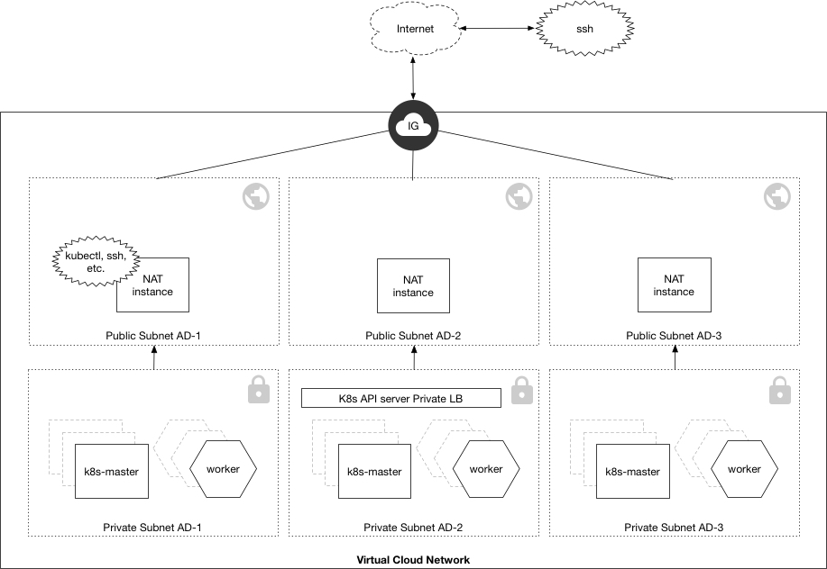

# Customizing the Deployment with Input Variables

## Mandatory Input Variables:

### OCI Provider Configuration

name                                | default                 | description
------------------------------------|-------------------------|-----------------
tenancy_ocid                        | None (required)         | Tenancy's OCI OCID
compartment_ocid                    | None (required)         | Compartment's OCI OCID
user_ocid                           | None (required)         | Users's OCI OCID
fingerprint                         | None (required)         | Fingerprint of the OCI user's public key
private_key_path                    | None (required)         | Private key file path of the OCI user's private key
region                              | us-phoenix-1            | String value of region to create resources

## Optional Input Variables:

### Compute Instance Configuration
name                                | default                 | description
------------------------------------|-------------------------|------------
etcdShape                           | VM.Standard1.1          | OCI shape for etcd nodes
k8sMasterShape                      | VM.Standard1.1          | OCI shape for k8s master(s)
k8sWorkerShape                      | VM.Standard1.2          | OCI shape for k8s worker(s)
master_oci_lb_enabled               | "true"                  | enable/disable the k8s master oci load balancer. "true": use oci load balancer for k8s master . "false": use a reverse proxy as a software load balancer for k8s masters.
etcdLBShape                         | 100Mbps                 | etcd cluster OCI Load Balancer shape / bandwidth
etcd_lb_enabled                     | "true"                  | enable/disable the etcd load balancer. "true" use the etcd load balancer ip, "false" use a list of etcd instance ips
k8sMasterLBShape                    | 100Mbps                 | Kubernetes Master OCI Load Balancer shape / bandwidth
k8sMasterAd1Count                   | 1                       | number of k8s masters to create in Availability Domain 1
k8sMasterAd2Count                   | 0                       | number of k8s masters to create in Availability Domain 2
k8sMasterAd3Count                   | 0                       | number of k8s masters to create in Availability Domain 3
k8sWorkerAd1Count                   | 1                       | number of k8s workers to create in Availability Domain 1
k8sWorkerAd2Count                   | 0                       | number of k8s workers to create in Availability Domain 2
k8sWorkerAd3Count                   | 0                       | number of k8s workers to create in Availability Domain 3
etcdAd1Count                        | 1                       | number of etcd nodes to create in Availability Domain 1
etcdAd2Count                        | 0                       | number of etcd nodes to create in Availability Domain 2
etcdAd3Count                        | 0                       | number of etcd nodes to create in Availability Domain 3
worker_iscsi_volume_create          | "false"                 | boolean flag indicating whether or not to attach an iSCSI volume to attach to each worker node
worker_iscsi_volume_size            | unset                   | optional size of an iSCSI volume to attach to each worker
worker_iscsi_volume_mount           | /var/lib/docker         | optional mount path of iSCSI volume when worker_iscsi_volume_size is set
etcd_iscsi_volume_create            | false                   | boolean flag indicating whether or not to attach an iSCSI volume to attach to each etcd node
etcd_iscsi_volume_size              | 50                      | size in GBs of volume when etcd_iscsi_volume_create is set

### TLS Certificates & SSH key pair
name                                | default                 | description
------------------------------------|-------------------------|------------
ca_cert                             | (generated)             | String value of PEM encoded CA certificate
ca_key                              | (generated)             | String value of PEM encoded CA private key
api_server_private_key              | (generated)             | String value of PEM private key of API server
api_server_cert                     | (generated)             | String value of PEM encoded certificate for API server
api_server_admin_token              | (generated)             | String value of the admin user's bearer token for API server
ssh_private_key                     | (generated)             | String value of PEM encoded SSH key pair for instances
ssh_public_key_openssh              | (generated)             | String value of OpenSSH encoded SSH key pair key for instances

### Network Configuration
name                                | default                 | description
------------------------------------|-------------------------|------------
flannel_network_cidr                | 10.99.0.0/16            | A CIDR notation IP range to use for flannel
flannel_backend                     | VXLAN                   | Backend to use for Flannel, choices are vxlan, udp, and host-gw

### Software Versions Installed on OCI Instances
name                                | default            | description
------------------------------------|--------------------|------------
docker_ver                          | 17.06.2.ol                     | Version of Docker to install
etcd_ver                            | v3.2.2                         | Version of etcd to install
flannel_ver                         | v0.9.1                         | Version of Flannel to install
k8s_ver                             | 1.8.5                          | Version of K8s to install (master and workers)
k8s_dns_ver                         | 1.14.2                         | Version of Kube DNS to install
k8s_dashboard_ver                   | 1.6.3                          | Version of Kubernetes dashboard to install
master_ol_image_name                | Oracle-Linux-7.4-2018.01.20-0  | Image name of an Oracle-Linux-7.X image to use for masters
worker_ol_image_name                | Oracle-Linux-7.4-2018.01.20-0  | Image name of an Oracle-Linux-7.X image to use for workers
etcd_ol_image_name                  | Oracle-Linux-7.4-2018.01.20-0  | Image name of an Oracle-Linux-7.X image to use for etcd nodes
nat_ol_image_name                   | Oracle-Linux-7.4-2018.01.20-0  | Image name of an Oracle-Linux-7.X image to use for NAT instances (if applicable)

#### OCI Plugins
name                                     | default   | description
-----------------------------------------|------------------|--------------------------
cloud_controller_user_ocid               | user_ocid        | OCID of the user calling the OCI API to create Load Balancers
cloud_controller_user_fingerprint        | fingerprint      | Fingerprint of the OCI user calling the OCI API to create Load Balancers
cloud_controller_user_private_key_path   | private_key_path | Private key file path of the OCI user calling the OCI API to create Load Balancers

#### Docker logging configuration
name                                | default   | description
------------------------------------|-----------|--------------------------
etcd_docker_max_log_size            | 50m       |max size of the etcd docker container logs
etcd_docker_max_log_files           | 5         |max number of etcd docker logs to rotate
master_docker_max_log_size          | 50m       |max size of the k8smaster docker container logs
master_docker_max_log_files         | 5         |max number of k8smaster docker container logs to rotate
worker_docker_max_log_size          | 50m       |max size of the k8sworker docker container logs
worker_docker_max_log_files         | 5         |max number of k8s master docker container logs to rotate

### Other
name                                | default                 | description
------------------------------------|-------------------------|------------
label_prefix                        | ""                      | Unique identifier to prefix to OCI resources

### Network Access Configuration

name                                | default     | description
------------------------------------|-------------|------------
control_plane_subnet_access         | public      | Whether instances in the control plane are launched in a public or private subnets
k8s_master_lb_access                | public      | Whether the Kubernetes Master Load Balancer is launched in a public or private subnets
etcd_lb_access                	    | private	  | Whether the etcd Load Balancer is launched in a public or private subnets

#### _Public_ Network Access (default)

When `control_plane_subnet_access=public` and `k8s_master_lb_access=public`, control plane instances and the Kubernetes Master Load Balancer are provisioned in _public_ subnets and automatically get both a public and private IP address. If the inbound security rules allow, you can communicate with them directly via their public IPs.

The following input variables are used to configure the inbound security rules on the public etcd, master, and worker subnets:

name                                | default                 | description
------------------------------------|-------------------------|------------
network_cidrs                       | See map in variables.tf | A CIDR notation IP range of the VCN and its subnets.
network_subnet_dns                  | See map in variables.tf | A DNS label for each of the subnet in the VCN (Max 15 characters)
etcd_cluster_ingress                | 10.0.0.0/16 (VCN only)  | A CIDR notation IP range that is allowed to access the etcd cluster. Must be a subset of the VCN CIDR.
etcd_ssh_ingress                    | 10.0.0.0/16 (VCN only)  | A CIDR notation IP range that is allowed to SSH to etcd nodes. Must be a subset of the VCN CIDR.
master_ssh_ingress                  | 10.0.0.0/16 (VCN only)  | A CIDR notation IP range that is allowed to access the master(s). Must be a subset of the VCN CIDR.
master_https_ingress                | 10.0.0.0/16 (VCN only)  | A CIDR notation IP range that is allowed to access the HTTPs port on the master(s). Must be a subset of the VCN CIDR.
worker_ssh_ingress                  | 10.0.0.0/16 (VCN only)  | A CIDR notation IP range that is allowed to SSH to worker(s). Must be a subset of the VCN CIDR.
worker_nodeport_ingress             | 10.0.0.0/16 (VCN only)  | A CIDR notation IP range that is allowed to access NodePorts (30000-32767) on the worker(s). Must be a subset of the VCN CIDR.
master_nodeport_ingress             | 10.0.0.0/16 (VCN only)  | A CIDR notation IP range that is allowed to access NodePorts (30000-32767) on the masters(s). Must be a subset of the VCN CIDR. 

#### _Private_ Network Access

When `control_plane_subnet_access=private`, `etcd_lb_access=private` and `k8s_master_lb_access=private`, control plane instances, etcd Load Balancer and the Kubernetes Master Load Balancer
 are provisioned in _private_ subnets. In this scenario, we will also set up an instance in a public subnet to
 perform  Network Address Translation (NAT) for instances in the private subnets so they can send outbound traffic.
 If your worker nodes need to accept incoming traffic from the Internet, an additional front-end Load Balancer will
 need to be provisioned in the public subnet to route traffic to workers in the private subnets.

The following input variables are used to configure the inbound security rules for the NAT instance(s) and any other instance or front-end Load Balancer in the public subnet:

name                                | default                 | description
------------------------------------|-------------------------|------------
dedicated_nat_subnets               | "true"                  | whether to provision dedicated subnets in each AD that are only used by NAT instance(s) (separate subnets = separate control)
public_subnet_ssh_ingress           | 0.0.0.0/0               | A CIDR notation IP range that is allowed to SSH to instances in the public subnet (including NAT instances)
public_subnet_http_ingress          | 0.0.0.0/0               | A CIDR notation IP range that is allowed access to port 80 on instances in the public subnet
public_subnet_https_ingress         | 0.0.0.0/0               | A CIDR notation IP range that is allowed access to port 443 on instances in the public subnet
natInstanceShape                    | VM.Standard1.1          | OCI shape for the optional NAT instance. Size according to the amount of expected _outbound_ traffic from nodes and pods
nat_instance_ad1_enabled            | "true"                  | whether to provision a NAT instance in AD 1 (only used when control_plane_subnet_access=private)
nat_instance_ad2_enabled            | "false"                 | whether to provision a NAT instance in AD 2 (only used when control_plane_subnet_access=private)
nat_instance_ad3_enabled            | "false"                 | whether to provision a NAT instance in AD 3 (only used when control_plane_subnet_access=private)

*Note*

Even though we can configure a NAT instance per AD, this [diagram](./images/private_cp_subnet_public_lb_failure.jpg) illustrates that each NAT Instance is still represents a single point of failure for the private subnet that routes outbound traffic to it.

#### _Private_ and _Public_ Network Access

It is also valid to set `control_plane_subnet_access=private` while keeping `etcd_lb_access=public` and `k8s_master_lb_access=public`. In this scenario, instances in the
cluster's control plane will still provisioned in _private_ subnets and require NAT instance(s). However, the Load
Balancer for your etcd and  back-end Kubernetes Master(s) will be launched in a public subnet and will therefore be accessible over the Internet if the inbound security rules allow.

*Note*

When `control_plane_subnet_access=private`, you still cannot SSH directly into your instances without going through a NAT instance.
